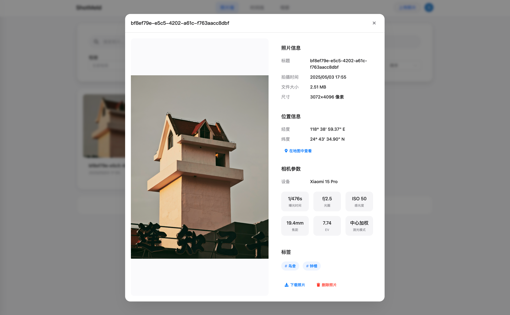
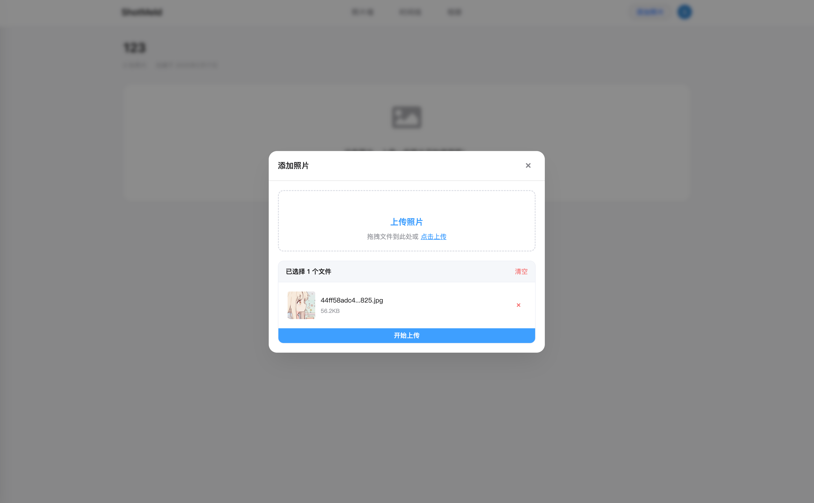

<p align="right">
	English / 
	<a href="https://github.com/ShotMeld/Shotmeld-web/blob/main/README.zh-CN.md">
    简体中文
	</a>
</p>

<div align="center">
	
	
# ShotMeld

照片管理系统 / Photo Management System
</div>

> CS183FZ[A] — Critical Skills Project Group Assignment

ShotMeld is a modern photo management system that helps users easily manage and organize their photo collections. The system provides an intuitive user interface and powerful features, making photo management simple and efficient.

## 🌟 Key Features

- 📸 Photo Upload and Management
- 📷 EXIF Parsing
- 🏷️ Tagging System
- 📚 Album Organization
- 📅 Timeline View
- 🔍 Advanced Search
- 🤖 AI Tagging
- 👥 User Authentication
- 🔒 Secure Storage

## 📷 Interface Showcase







## 📋 System Requirements

- Node.js >= 16.0.0
- npm >= 7.0.0 or yarn >= 1.22.0

## 🛠️ Installation and Running

1. Clone the repository
```bash
git clone https://github.com/ShotMeld/Shotmeld-web.git
cd shotmeld-web
```

2. Install dependencies
```bash
npm install
# or
yarn install
```

3. Configure environment variables
```bash
cp .env.example .env
```
Edit the `.env` file to set necessary environment variables.

4. Start development server
```bash
npm run dev
# or
yarn dev
```

5. Build for production
```bash
npm run build
# or
yarn build
```

## 🔧 Environment Variables Configuration

The project uses the following environment variables (configure in `.env` file):

- `VITE_API_BASE_URL`: API server address

## 📁 Project Structure

```
shotmeld-web/
├── src/
│   ├── api/          # API interfaces
│   ├── components/   # Components
│   ├── views/        # Pages
│   ├── router/       # Route configuration
│   ├── store/        # State management
│   └── utils/        # Utility functions
├── public/           # Static assets
└── dist/            # Build output
```