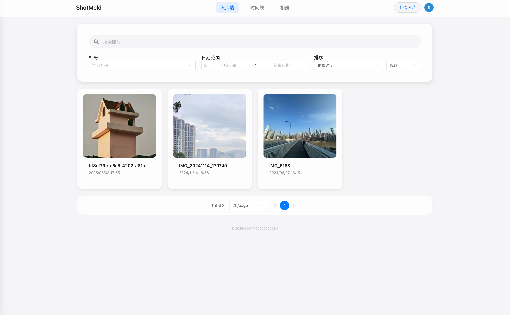
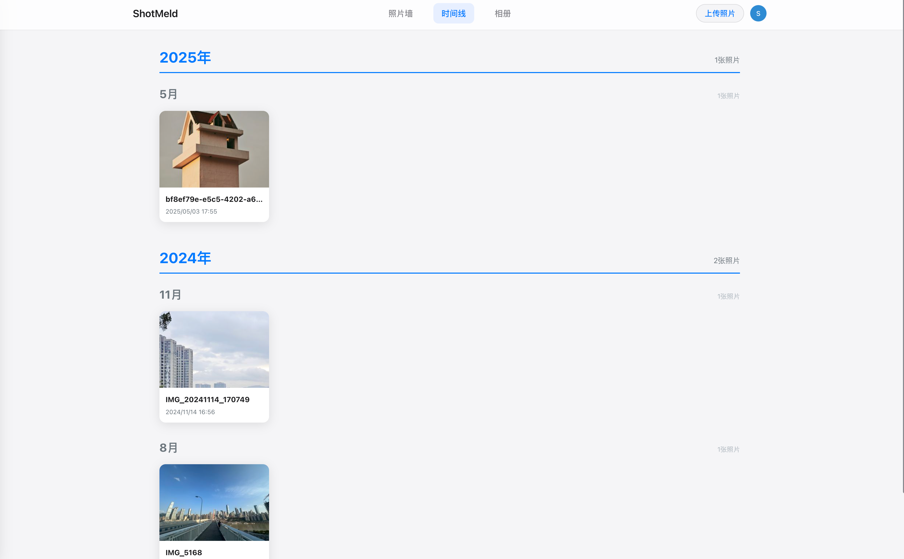

<p align="right">
	<a href="https://github.com/ShotMeld/Shotmeld-web/blob/main/README.md">
    English
	</a> / 
	简体中文
</p>

<div align="center">
	
	
# ShotMeld

照片管理系统 / Photo Management System

</div>

> CS183FZ[A] — Critical Skills Project 小组作业

ShotMeld 是一个现代化的照片管理系统，帮助用户轻松管理和组织他们的照片收藏。系统提供了直观的用户界面和强大的功能，让照片管理变得简单而高效。

## 🌟 主要特性

- 📸 照片上传和管理
- 📷 EXIF 解析
- 🏷️ 标签系统
- 📚 相册组织
- 📅 时间轴视图
- 🔍 高级搜索
- 🤖 AI 标签
- 👥 用户认证
- 🔒 安全存储

## 📷 界面展示







## 📋 系统要求

- Node.js >= 16.0.0
- npm >= 7.0.0 或 yarn >= 1.22.0

## 🛠️ 安装和运行

1. 克隆仓库

```bash
git clone https://github.com/ShotMeld/Shotmeld-web.git
cd shotmeld-web
```

2. 安装依赖

```bash
npm install
# 或
yarn install
```

3. 配置环境变量

```bash
cp .env.example .env
```

编辑 `.env` 文件，设置必要的环境变量。

4. 启动开发服务器

```bash
npm run dev
# 或
yarn dev
```

5. 构建生产版本

```bash
npm run build
# 或
yarn build
```

## 🔧 环境变量配置

项目使用以下环境变量（在 `.env` 文件中配置）：

- `VITE_API_BASE_URL`: API 服务器地址

## 📁 项目结构

```
shotmeld-web/
├── src/
│   ├── api/          # API 接口
│   ├── components/   # 组件
│   ├── views/        # 页面
│   ├── router/       # 路由配置
│   ├── store/        # 状态管理
│   └── utils/        # 工具函数
├── public/           # 静态资源
└── dist/            # 构建输出
```
